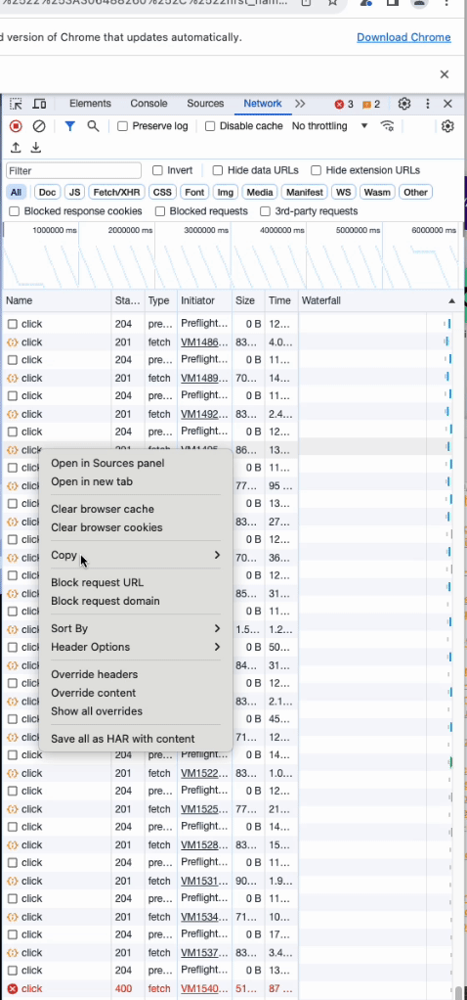

# How to run

1. install all dependencies in runner folder using `yarn install`
2. copy your curl request from google chrome network or safari network dev tools tab to `request.sh` file contents
3. run it using `node index.js` command

